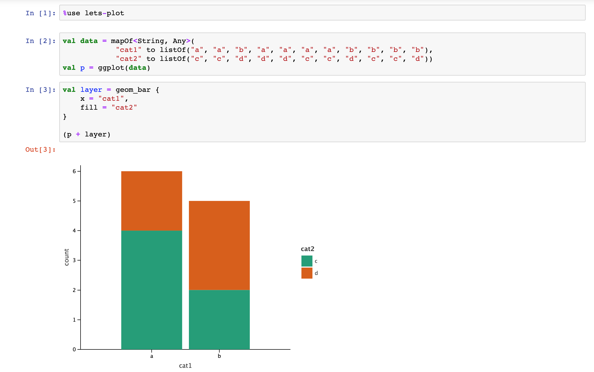

[](https://confluence.jetbrains.com/display/ALL/JetBrains+on+GitHub)
[](https://pypi.org/project/kotlin-jupyter-kernel/)
[](https://anaconda.org/jetbrains/kotlin-jupyter-kernel)
[](https://www.apache.org/licenses/LICENSE-2.0)
[](https://mybinder.org/v2/gh/kotlin/kotlin-jupyter/master?filepath=samples)

# Kotlin kernel for IPython/Jupyter

[Kotlin](https://kotlinlang.org/) ([[kotlin_version]]) kernel for [Jupyter](https://jupyter.org).

Beta version. Tested with Jupyter Notebook 6.0.3, Jupyter Lab 1.2.6 and Jupyter Console 6.1.0
on Windows, Ubuntu Linux and MacOS. Using with Jupyter Console frontend is problematic now because of
logging which cannot be switched off. Tuning logging options is planned for future releases.



To start using Kotlin kernel for Jupyter take a look at [introductory guide](https://github.com/cheptsov/kotlin-jupyter-demo/blob/master/index.ipynb).

Example notebooks can be found in the [samples](../samples) folder

Try samples online: [](https://mybinder.org/v2/gh/kotlin/kotlin-jupyter/master?filepath=samples)

## Installation

There are three ways to install kernel:

### Conda

If you have `conda` installed, just run the following command to install stable package version:
 
`conda install -c jetbrains kotlin-jupyter-kernel` ([package home](https://anaconda.org/jetbrains/kotlin-jupyter-kernel))

To install conda package from the dev channel:

`conda install -c jetbrains-dev kotlin-jupyter-kernel` ([package home](https://anaconda.org/jetbrains-dev/kotlin-jupyter-kernel))

Uninstall: `conda remove kotlin-jupyter-kernel`

### Pip

You can also install this package through `pip`:
 
Stable:
`pip install kotlin-jupyter-kernel` ([package home](https://pypi.org/project/kotlin-jupyter-kernel/))

Dev:
`pip install -i https://test.pypi.org/simple/ kotlin-jupyter-kernel` ([package home](https://test.pypi.org/project/kotlin-jupyter-kernel/))

Uninstall: `pip uninstall kotlin-jupyter-kernel`

### From sources

```bash
git clone https://github.com/Kotlin/kotlin-jupyter.git
cd kotlin-jupyter
./gradlew install
```

Default installation path is `~/.ipython/kernels/kotlin/`. To install to some other location use option `-PinstallPath=`, but note that Jupyter looks for kernel specs files only in predefined places

Uninstall: `./gradlew uninstall`  

## Usage

- `jupyter console --kernel=kotlin`
- `jupyter notebook`
- `jupyter lab`

To start using `kotlin` kernel inside Jupyter Notebook or JupyterLab create a new notebook with `kotlin` kernel.

## Supported functionality

### REPL commands

The following REPL commands are supported:
[[supported_commands]]
 
### Dependencies resolving annotations

It is possible to add dynamic dependencies to the notebook using the following annotations:
 - `@file:DependsOn(<coordinates>)` - adds artifacts to classpath. Supports absolute and relative paths to class directories or jars, ivy and maven artifacts represented by colon separated string
 - `@file:Repository(<absolute-path>)` - adds a directory for relative path resolution or ivy/maven repository.
 To specify Maven local, use `@file:Repository("*mavenLocal")`.
 
Note that dependencies in remote repositories are resolved via Ivy resolver.
Caches are stored in `~/.ivy2/cache` folder by default. Sometimes, due to network
issues or running several artifacts resolutions in parallel, caches may get corrupted.
If you have some troubles with artifacts resolution, please remove caches, restart kernel
and try again.
 
### Default repositories

The following maven repositories are included by default:
 - [Bintray JCenter](https://jcenter.bintray.com)
 - [Maven Central](https://repo.maven.apache.org/maven2)
 - [JitPack](https://jitpack.io/)

### Line Magics

The following line magics are supported:
[[magics]]
 
 See detailed info about line magics [here](magics.md).
 
### Supported Libraries

When a library is included with `%use` keyword, the following functionality is added to the notebook:
 - repositories to search for library artifacts
 - artifact dependencies
 - default imports
 - library initialization code
 - renderers for special types, e.g. charts and data frames

This behavior is defined by `json` library descriptor. Descriptors for all supported libraries can be found in [libraries](../libraries) directory.
A library descriptor may provide a set of properties with default values that can be overridden when library is included.
The major use case for library properties is to specify particular version of library. If descriptor has only one property, it can be 
defined without naming:
```
%use krangl(0.10)
```
If library descriptor defines more than one property, property names should be used:
```
%use spark(scala=2.11.10, spark=2.4.2)
```
Several libraries can be included in single `%use` statement, separated by `,`:
```
%use lets-plot, krangl, mysql(8.0.15)
```
You can also specify the source of library descriptor. By default, it's taken from the libraries directory
of kernel installation. If you want to try descriptor from another revision, use the following syntax:
```
// Specify some git tag from this repository
%use lets-plot@0.8.2.5
// Specify commit sha, with more verbose syntax
%use lets-plot@ref[24a040fe22335648885b106e2f4ddd63b4d49469]
// Specify git ref along with library arguments
%use krangl@dev(0.10)
```
Other options are resolving library descriptor from a local file or from remote URL:
```
// Load library from file
%use mylib@file[/home/user/lib.json]
// Load library from file: kernel will guess it's a file actually
%use @/home/user/libs/lib.json
// Or use another approach: specify a directory and file name without 
// extension (it should be JSON in such case) before it
%use lib@/home/user/libs
// Load library descriptor from a remote URL
%use herlib@url[https://site.com/lib.json]
// If your URL responds with 200(OK), you may skip `url[]` part:
%use @https://site.com/lib.json
// You may omit library name for file and URL resolution:
%use @file[lib.json]
```

List of supported libraries:
[[supported_libraries]]

### Rich output
  
By default the return values from REPL statements are displayed in the text form. To use richer representations, e.g.
 to display graphics or html, it is possible to send MIME-encoded result to the client using the `MIME` helper function: 
```kotlin
fun MIME(vararg mimeToData: Pair<String, Any>): MimeTypedResult 
```
E.g.:
```kotlin
MIME("text/html" to "<p>Some <em>HTML</em></p>", "text/plain" to "No HTML for text clients")

```
HTML outputs can also be rendered with `HTML` helper function:
```kotlin
fun HTML(text: String): MimeTypedResult
```

### Autocompletion

Press `TAB` to get the list of suggested items for completion. In Jupyter Notebook, you don't need to press `TAB`,
completion is requested automatically. Completion works for all globally defined symbols and for local symbols 
which were loaded into notebook during cells evaluation. 

### Error analysis

If you use Jupyter Notebook as Jupyter client, you will also see that compilation errors and warnings are underlined in
red and in yellow correspondingly. This is achieved by kernel-level extension of Jupyter notebook which sends
error-analysis requests to kernel and renders their results. If you hover the cursor over underlined text, you will get 
an error message which can help you to fix the error.

## Debugging

1. Run `./gradlew installDebug`. Use option `-PdebugPort=` to specify port address for debugger. Default port is 1044.
2. Run `jupyter-notebook`
3. Attach a remote debugger to JVM with specified port 

## Adding new libraries

To support new `JVM` library and make it available via `%use` magic command you need to create a library descriptor for it.

Check [libraries](../libraries) directory to see examples of library descriptors.

Library descriptor is a `<libName>.json` file with the following fields:
- `properties`: a dictionary of properties that are used within library descriptor
- `description`: a short library description which is used for generating libraries list in README
- `link`: a link to library homepage. This link will be displayed in `:help` command
- `minKernelVersion`: a minimal version of Kotlin kernel which may be used with this descriptor
- `repositories`: a list of maven or ivy repositories to search for dependencies
- `dependencies`: a list of library dependencies
- `imports`: a list of default imports for library
- `init`: a list of code snippets to be executed when library is included
- `initCell`: a list of code snippets to be executed before execution of any cell
- `shutdown`: a list of code snippets to be executed on kernel shutdown. Any cleanup code goes here
- `renderers`: a list of type converters for special rendering of particular types

*All fields are optional

Fields for type renderer:
- `class`: fully-qualified class name for the type to be rendered 
- `result`: expression that produces output value. Source object is referenced as `$it`

Name of the file is a library name that is passed to '%use' command

Library properties can be used in any parts of library descriptor as `$property`

To register new library descriptor:
1. For private usage - create it anywhere on your computer and reference it using file syntax.
2. For sharing with community - commit it to [libraries](../libraries) directory and create pull request.

If you are maintaining some library and want to update your library descriptor, create pull request with your update. 
After your request is accepted, new version of your library will be available to all Kotlin Jupyter users 
immediately on next kernel startup (no kernel update is needed) - but only if they use `useLatestDescriptors` magic.
If not, kernel update is needed.
