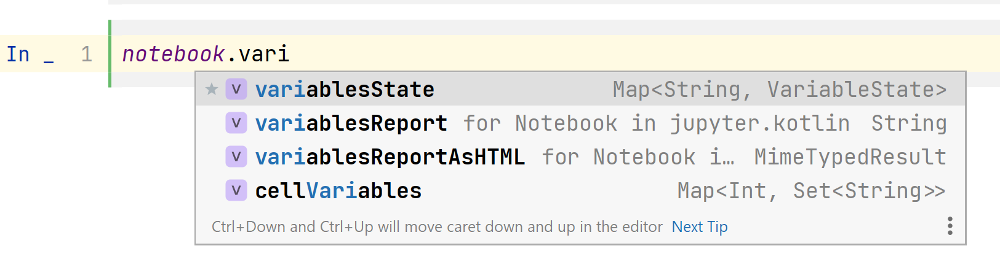

# Adding new libraries

<!-- Start Document Outline -->

* [Overview](#overview)
* [Supported integration features](#supported-integration-features)
	* [Dependencies](#dependencies)
		* [Descriptor API](#descriptor-api)
		* [JupyterIntegration API](#jupyterintegration-api)
	* [Repositories](#repositories)
		* [Descriptor API](#descriptor-api-1)
		* [JupyterIntegration API](#jupyterintegration-api-1)
	* [Initial imports](#initial-imports)
		* [Descriptor API](#descriptor-api-2)
		* [JupyterIntegration API](#jupyterintegration-api-2)
	* [Callbacks after library loading (called once)](#callbacks-after-library-loading-called-once)
		* [Descriptor API](#descriptor-api-3)
		* [JupyterIntegration API](#jupyterintegration-api-3)
	* [Callbacks before each cell execution](#callbacks-before-each-cell-execution)
		* [Descriptor API](#descriptor-api-4)
		* [JupyterIntegration API](#jupyterintegration-api-4)
	* [Callbacks after each cell execution](#callbacks-after-each-cell-execution)
		* [JupyterIntegration API](#jupyterintegration-api-5)
	* [Callbacks on cell execution interruption](#callbacks-on-cell-execution-interruption)
		* [JupyterIntegration API](#jupyterintegration-api-6)
	* [Callbacks right before kernel shutdown](#callbacks-right-before-kernel-shutdown)
		* [Descriptor API](#descriptor-api-5)
		* [JupyterIntegration API](#jupyterintegration-api-7)
	* [Callbacks on color scheme change](#callbacks-on-color-scheme-change)
		* [JupyterIntegration API](#jupyterintegration-api-8)
	* [Results renderers](#results-renderers)
		* [Descriptor API](#descriptor-api-6)
		* [JupyterIntegration API](#jupyterintegration-api-9)
	* [Results text renderers](#results-text-renderers)
		* [JupyterIntegration API](#jupyterintegration-api-10)
	* [Throwables renderers](#throwables-renderers)
		* [JupyterIntegration API](#jupyterintegration-api-11)
	* [Variables handling](#variables-handling)
		* [JupyterIntegration API](#jupyterintegration-api-12)
	* [Annotated classes handling](#annotated-classes-handling)
		* [JupyterIntegration API](#jupyterintegration-api-13)
	* [File annotations handling](#file-annotations-handling)
		* [JupyterIntegration API](#jupyterintegration-api-14)
	* [Code preprocessing](#code-preprocessing)
		* [JupyterIntegration API](#jupyterintegration-api-15)
	* [Library static resources loading](#library-static-resources-loading)
		* [JupyterIntegration API](#jupyterintegration-api-16)
	* [Variables reporting](#variables-reporting)
	* [Internal variables markers](#internal-variables-markers)
		* [JupyterIntegration API](#jupyterintegration-api-17)
	* [Typename rules for transitively loaded integration classes](#typename-rules-for-transitively-loaded-integration-classes)
		* [Descriptor API](#descriptor-api-7)
		* [JupyterIntegration API](#jupyterintegration-api-18)
	* [Minimal kernel version supported by the library](#minimal-kernel-version-supported-by-the-library)
		* [Descriptor API](#descriptor-api-8)
		* [JupyterIntegration API](#jupyterintegration-api-19)
	* [Library options](#library-options)
		* [Descriptor API](#descriptor-api-9)
		* [JupyterIntegration API](#jupyterintegration-api-20)
	* [Link to the library site](#link-to-the-library-site)
		* [Descriptor API](#descriptor-api-10)
		* [JupyterIntegration API](#jupyterintegration-api-21)
	* [Library description](#library-description)
		* [Descriptor API](#descriptor-api-11)
		* [JupyterIntegration API](#jupyterintegration-api-22)
* [Creating library descriptor](#creating-library-descriptor)
* [Integration using Kotlin API](#integration-using-kotlin-api)
	* [Adding library integration using KSP plugin](#adding-library-integration-using-ksp-plugin)
	* [Adding library integration avoiding use of annotation processor](#adding-library-integration-avoiding-use-of-annotation-processor)
	* [Integration testing for the integration logic](#integration-testing-for-the-integration-logic)
	* [Integration using other build systems](#integration-using-other-build-systems)

<!-- End Document Outline -->

## Overview

Generally, there are two ways of adding new library:
1. [Creating JSON library descriptor](#Creating-library-descriptor). It's easy-to-go solution that doesn't even
   require you to make any changes to the library itself. You create a JSON file and get the ability to define most
   frequently used features such as renderers and initial imports. This descriptor is loaded into notebook
   with help of [`%use` line magic](README.md#supported-libraries). Exact syntax depends on where the descriptor is located.
2. [Integration using Kotlin API](#Integration-using-Kotlin-API). Here, you define an integration class
   in your library code (or you can create a separate project for integration if it's a library you don't maintain).
   You can then use all available integration features in this case. Integration is loaded automatically when
   the JAR containing `META-INF/kotlin-jupyter-libraries/libraries.json` file with the integration class name in it
   is added to the current notebook classpath. It can be done with `@file:DependsOn` annotation or with help of
   descriptor (see above) that defines the corresponding dependency. Additionally, it is possible to write tests
   for this kind of integrations.

Library integrations regardless of the way they are defined may define dependencies
and some callbacks (code executions). Dependencies may contain Kotlin API based integrations, and code executions
may contain `%use` statements which means that library integrations may load other libraries, and so on. Don't
hesitate to rely on this feature.

Summing up, if you want to use a feature from the table below, you can do one of the following:

1. If the feature is supported in descriptor API, you can create a JSON file containing this feature description as it is described below.
   This JSON file is then loaded into notebook via `%use` line magic.
2. If the feature is supported in descriptor API, you can load corresponding JSON string directly using
   `loadLibraryDescriptor` method inside notebook cell.
3. You can add the feature directly from the notebook cell using `USE {}` method and taking corresponding
   methods from "JupyterIntegration API" column, i.e.
    ```kotlin
    USE {
        import("my.awesome.Clazz")
    }
    ```
4. You can add the feature directly from the notebook cell if you have an instance of `LibraryDefinition` (that
   could be created i.e. using `libraryDefinition {}` method), using following syntax:
    ```kotlin
    USE(libraryDefinition)
    ```
5. Inside a Kotlin JVM library, you can create a class implementing `LibraryDefinition` / `LibraryDefinitionProducer` in one of the following ways:
    - Just create a direct implementor of `LibraryDefinition`. Override properties defined in "LibraryDefinition API" column
    - Extend `LibraryDefinitionImpl`. Set its properties defined in "LibraryDefinition API" column
    - Implement `JupyterIntegration`. [Override `Builder.onLoaded` method](#adding-library-integration-using-ksp-plugin) and use methods from `JupyterIntegration API` column
      This class is to be loaded into notebook via `%use` command along with the whole library artifact. To let the notebook know about this class,
      you should adjust the build correspondingly. If you don't adjust the build, class will not be loaded, but you can
      still load this class from the notebook using `loadLibraryDefinitions()` or `loadLibraryProducers()` methods.

## Supported integration features

All supported integration features are given in the following table. You can also learn the API using [this interactive guide](../samples/api-guide.ipynb).

| Feature                                                                                                                   | Descriptor API             | LibraryDefinition API         | JupyterIntegration API                                                                                                         |
|:--------------------------------------------------------------------------------------------------------------------------|:---------------------------|:------------------------------|--------------------------------------------------------------------------------------------------------------------------------|
| [Dependencies](#dependencies)                                                                                             | `dependencies`             | `dependencies`                | `dependencies()`                                                                                                               |
| [Repositories](#repositories)                                                                                             | `repositories`             | `repositories`                | `repositories()`<br>`addRepository()`<br>`repository()`                                                                        |
| [Initial imports](#initial-imports)                                                                                       | `imports`                  | `imports`                     | `import()`<br>`importPackage()`                                                                                                |
| [Callbacks after library loading (called once)](#callbacks-after-library-loading-called-once)                             | `init`                     | `init`                        | `onLoaded{}`                                                                                                                   |
| [Callbacks before each cell execution](#callbacks-before-each-cell-execution)                                             | `initCell`                 | `initCell`                    | `beforeCellExecution{}`                                                                                                        |
| [Callbacks after each cell execution](#callbacks-after-each-cell-execution)                                               | -                          | `afterCellExecution`          | `afterCellExecution{}`                                                                                                         |
| [Callbacks on cell execution interruption](#callbacks-on-cell-execution-interruption)                                     | -                          | `interruptionCallbacks`       | `onInterrupt{}`                                                                                                                |
| [Callbacks right before kernel shutdown](#callbacks-right-before-kernel-shutdown)                                         | `shutdown`                 | `shutdown`                    | `onShutdown{}`                                                                                                                 |
| [Callbacks on color scheme change](#callbacks-on-color-scheme-change)                                                     | -                          | `colorSchemeChangedCallbacks` | `onColorSchemeChange{}`                                                                                                        |
| [Results renderers](#results-renderers)                                                                                   | `renderers`                | `renderers`                   | `addRenderer()`<br>`render<T>{}`<br>`renderWithHost<T>{}`                                                                      |
| [Results text renderers](#results-text-renderers)                                                                         | -                          | `textRenderers`               | `addTextRenderer()`                                                                                                            |
| [Throwables renderers](#throwables-renderers)                                                                             | -                          | `throwableRenderers`          | `addThrowableRenderer()`<br>`renderThrowable<T>{}`                                                                             |
| [Variables handling](#variables-handling)                                                                                 | -                          | `converters`                  | `addTypeConverter()`<br>`onVariable{}`<br>`updateVariable{}`<br>`onVariableByRuntimeType{}`<br>`updateVariableByRuntimeType{}` |
| [Annotated classes handling](#annotated-classes-handling)                                                                 | -                          | `classAnnotations`            | `addClassAnnotationHandler()`<br>`onClassAnnotation<T>{}`                                                                      |
| [File annotations handling](#file-annotations-handling)                                                                   | -                          | `fileAnnotations`             | `addFileAnnotationHanlder()`<br>`onFileAnnotation<T>{}`                                                                        |
| [Code preprocessing](#code-preprocessing)                                                                                 | -                          | `codePreprocessors`           | `addCodePreprocessor()`<br>`preprocessCodeWithLibraries{}`<br>`preprocessCode{}`                                               |
| [Library static resources loading](#library-static-resources-loading)                                                     | `resources`                | `resources`                   | `resource()`                                                                                                                   |
| [Internal variables markers](#internal-variables-markers)                                                                 | -                          | `internalVariablesMarkers`    | `markVariableInternal()`                                                                                                       |
| [Typename rules for transitively loaded integration classes](#typename-rules-for-transitively-loaded-integration-classes) | `integrationTypeNameRules` | `integrationTypeNameRules`    | `addIntegrationTypeNameRule()`<br>`acceptIntegrationTypeNameIf{}`<br>`discardIntegrationTypeNameIf{}`                          |
| [Minimal kernel version supported by the library](#minimal-kernel-version-supported-by-the-library)                       | `minKernelVersion`         | `minKernelVersion`            | `setMinimalKernelVersion()`                                                                                                    |
| [Library options](#library-options)                                                                                       | `properties`               | `options`                     | `addOption()`<br>`addOptions()`                                                                                                |
| [Link to the library site, used to generate README](#link-to-the-library-site)                                            | `link`                     | `website`                     | `setWebsite()`                                                                                                                 |
| [Library description, used to generate README](#library-description)                                                      | `description`              | `description`                 | `setDescription()`                                                                                                             |

### Dependencies

It doesn't matter what API you're using for adding dependencies, they are just Kotlin strings in the end.

These are strings describing notebook dependencies:
- Coordinates of Maven dependencies in form of `<group>:<artifact>:<version>`
- Absolute paths to the local JAR files
- Absolute paths to the local directories containing classes

Mind the following:
- `compile` and `runtime` scopes of dependencies are resolved transitively, but they all are added to
  both compile and runtime classpath. That's why you may see undesired variants offered in completion
- In Kotlin Notebook, sources of the dependencies are being resolved and included into response metadata.
  In other clients, they do not. To control this behavior, use `SessionOptions.resolveSources`
- MPP libraries are usually not resolved by Maven resolver. You should either use `jvm` variants of these
  artifacts or enable experimental multiplatform resolution with `SessionOptions.resolveMpp`
- To show current notebook classpath, use `:classpath` command

#### Descriptor API
```json
{
  "dependencies": [
    "<dependency1>",
    "<dependency2>"
  ]
}
```

#### JupyterIntegration API
```kotlin
USE {
    dependencies("<dependency1>", "<dependency2>")
    // or
    dependencies {
        implememntation("<dependency1>")
    }
}
```

### Repositories

Repositories are strings describing where the dependencies come from:
- Maven repositories (URLs + possible credentials)
- Local directories, relatively to which local dependencies are resolved

Maven repositories might have credentials.

#### Descriptor API
```json
{
  "repositories": [
    "<repo1-url>",
    {
      "path": "<repo2-url>",
      "username": "auth-username",
      "password": "auth-token"
    }
  ]
}
```

#### JupyterIntegration API
```kotlin
USE {
    repositories("<repo1>", "<repo2>")
    // or
    repositories {
        maven {
            url = "<repo1-url>"
            credentials {
                username = "auth-username"
                password = "auth-token"
            }
        }
    }
}
```

### Initial imports

Imports are just import declarations that are used by all the following cells.
They could be star-ended and usual

#### Descriptor API
```json
{
  "imports": [
    "my.package.*",
    "my.package.Clazz"
  ]
}
```

#### JupyterIntegration API
```kotlin
USE {
    imports("my.package.*", "my.package.Clazz")
    // or
    import<Clazz>()
    importPackage<Clazz>()
}
```

### Callbacks after library loading (called once)

Code that is executed - and in case of descriptor API also compiled - right after library loading
In descriptor API codes are executed separately and not merged into one snippet

#### Descriptor API
```json
{
  "init": [
    "val x = 3",
    "%use dataframe"
  ]
}
```

#### JupyterIntegration API
```kotlin
USE {
    onLoaded {
        println("Integration loaded")
        // Variable x will be visible inside the notebook
        scheduleExecution("val x = 3")
    }
}
```

### Callbacks before each cell execution

Code that is executed - and in case of descriptor API also compiled - right before each user-initiated cell execution
In descriptor API codes are executed separately and not merged into one snippet

#### Descriptor API
```json
{
  "initCell": [
    "val y = x + 1",
    "println(\"abc\")"
  ]
}
```

#### JupyterIntegration API
```kotlin
USE {
    beforeCellExecution {
        println("Before cell execution")
        // Variable x will be visible inside the notebook
        scheduleExecution("val x = 3")
    }
}
```

### Callbacks after each cell execution

Code that is executed right after each user-initiated cell execution.

#### JupyterIntegration API
```kotlin
USE {
    afterCellExecution { snippetInstance, resultField ->
        println("After cell execution: ${resultField.name} = ${resultField.value}")
        // Variable x will be visible inside the notebook
        scheduleExecution("val x = 3")
    }
}
```

### Callbacks on cell execution interruption

Code that is executed when cell execution was interrupted by user.

#### JupyterIntegration API
```kotlin
USE {
    onInterrupt {
        println("Execution was interrupted...")
    }
}
```

### Callbacks right before kernel shutdown

Code that is executed when user initiated a kernel shutdown.

#### Descriptor API
```json
{
  "shutdown": [
    "val y = x + 1",
    "println(\"abc\")"
  ]
}
```

#### JupyterIntegration API
```kotlin
USE {
    onShutdown {
        println("Bye!")
    }
}
```

### Callbacks on color scheme change

Code that is executed when the user changes color scheme in the IDE with the notebook opened and session started.
It doesn't work this way in the clients different from Kotlin Notebook, but it's safe to use in any client.

#### JupyterIntegration API
```kotlin
var isDark = notebook.currentColorScheme == ColorScheme.DARK
USE {
    println("Dark? - $isDark")

    onColorSchemeChange { colorScheme ->
        isDark = colorScheme == ColorScheme.DARK
        println("Color scheme is changed")
    }
}
```

### Results renderers

See [information about rendering](https://github.com/Kotlin/kotlin-jupyter#rendering)

#### Descriptor API
```json
{
  "renderers": {
    "org.jetbrains.letsPlot.intern.Plot": "HTML(frontendContext.getHtml($it as org.jetbrains.letsPlot.intern.Plot))"
  }
}
```

#### JupyterIntegration API
```kotlin
USE {
    render<Plot> {
        HTML(frontendContext.getHtml(it))
    }
}
```

### Results text renderers

See [information about rendering](https://github.com/Kotlin/kotlin-jupyter#rendering)

#### JupyterIntegration API
```kotlin
USE {
    addTextRenderer { processor, table ->
        (table as? Table)?.let { frontendContext.getPlainText(it) }
    }
}
```

### Throwables renderers

See [information about rendering](https://github.com/Kotlin/kotlin-jupyter#rendering)

#### JupyterIntegration API
```kotlin
USE {
    renderThrowable<NullPointerException> { npe ->
        "Isn't Kotlin null-safe?"
    }
}
```

### Variables handling

[Variables handlers](https://github.com/Kotlin/kotlin-jupyter/blob/295bf977765b3a61b118edc4e6ac41d1d4fbb1f3/jupyter-lib/api/src/main/kotlin/org/jetbrains/kotlinx/jupyter/api/fieldsHandling.kt#L30) are run for each applicable property of
executed snippets. They also give access to `KotlinKernelHost`, so it's possible to execute code there.
See corresponding methods documentation for more information.

#### JupyterIntegration API
```kotlin
USE {
    updateVariable<MyType> { value, kProperty ->
        // MyWrapper class should be previously defined in the notebook
        execute("MyWrapper(${kProperty.name})").name
    }
    
    onVariable<MyType2> { value, kProperty ->
        println("Variable ${kProperty.name}=$value executed!")
    }
}
```

### Annotated classes handling

If you have an annotation with runtime retention, you can mark a cell's class with this annotation,
and marked classes could be processed then. Annotations arguments are not available in this type of callback,
but this API should become more consistent in the future versions of kernel.

#### JupyterIntegration API
```kotlin
// Should have runtime retention
annotation class MyAnnotation

USE {
    onClassAnnotation<MyAnnotation> { classifiersList -> println("Annotated classes: $classifiersList") }
}

@MyAnnotation
class MyClass

```

### File annotations handling

You can add file-level annotations to the code snippets. Examples of such annotations are `@file:DependsOn()` and
`@file:Repository()` that are used by kernel to add dependencies to the notebook. In the callback you have
access to the annotation object and can access assigned annotation properties.

#### JupyterIntegration API
```kotlin
// Might have any retention, but files should be valid target
annotation class MyAnnotation

USE {
    onFileAnnotation<MyAnnotation> {
        val myAnno = it.first() as MyAnnotation
        println("My annotation object: $myAnno")
    }
}
```

### Code preprocessing

Code written by user could be amended in any way before execution. One of such transformations is magics preprocessing
that are cut off of the code and specifically processed. It's possible to write your own preprocessor: it gets the
code and should return amended code. Preprocessors are applied one after another depending on their priority and
order.

#### JupyterIntegration API
```kotlin
USE {
    preprocessCode { code -> generateRunBlocking(code) }
}
```

### Library static resources loading

Static resources such as JS and CSS files could be used by the library producing any HTML. Generally,
some specific wrappers should be written to load resources correctly. You can do it yourself or let kernel
infrastructure doing it for you. Resource bundles builder DSL is defined and documented [here](https://github.com/Kotlin/kotlin-jupyter/blob/master/jupyter-lib/api/src/main/kotlin/org/jetbrains/kotlinx/jupyter/api/libraries/resourceBuilders.kt#L11)

#### JupyterIntegration API
```kotlin
USE {
    resources {
        js("plotly") {
            //...
        }
    }
}
```

### Variables reporting

You can see what variables have been defined in the notebook - either in plain text or in HTML form


### Internal variables markers

To ignore some variables in the variable report, mark these variables as internal

#### JupyterIntegration API

```kotlin
USE {
    markVariableInternal { prop ->
        prop.name.startsWith("_")
    }
}
```

### Typename rules for transitively loaded integration classes

As it was mentioned before, libraries can load other libraries transitively: either by executing `%use ...` as
a part of the initialization code or by including a dependency that contains an integration. By default, all
integration classes found in the dependencies, are loaded. But you can turn off loading of some integrations
by using typename rules for skipping them. At the same time, library can load its integration class forcefully
specifying "accepting" typename rule, so that even if typename is disabled by the loader library, corresponding
class will be loaded.

#### Descriptor API
```json5
{
  "integrationTypeNameRules": [
    "-:org.jetbrains.kotlinx.dataframe.**",
    //"+:org.jetbrains.kotlinx.dataframe.**",
  ]
}
```

#### JupyterIntegration API
```kotlin
USE {
    discardIntegrationTypeNameIf {
        it.startsWith("org.jetbrains.kotlinx.dataframe.")
    }
    //    acceptIntegrationTypeNameIf {
    //        it.startsWith("org.jetbrains.kotlinx.dataframe.")
    //    }
}
```

### Minimal kernel version supported by the library

You can define minimal kernel version that is supported by the library integration.
In `JupyterIntegration` API it's also possible to check `notebook.kernelVersion` in a way you want.

#### Descriptor API
```json
{
  "minKernelVersion": "0.11.0.1"
}
```

#### JupyterIntegration API
```kotlin
USE {
    setMinimalKernelVersion("0.11.0.1")
}
```

### Library options

Library options serve several goals:
 - extract some frequently updatable parts of the library descriptors (such as library versions)
 - assist Renovate GitHub app to update libraries versions
 - pass some values transitively in library loading so that libraries might know through what other libraries they were
 loaded

**Important! Give more unique names for the options of your library because these options could override some other options, and it may lead to unexpected quirks**

#### Descriptor API

Options ending with `-renovate-hint` are ignored in descriptors and shouldn't be visible

```json
{
  "properties": [
    { "name": "api", "value": "4.4.1" },
    { "name": "api-renovate-hint", "value": "update: package=org.jetbrains.lets-plot:lets-plot-kotlin-kernel" }
  ],
  "dependencies": [
    "org.company:library:$api"
  ]
}
```

#### JupyterIntegration API

```kotlin
USE {
    // Options in JupyterIntegration API could be only used when this library loads some other integration transitively,
    // and integration class' constructor has two arguments, second of which is of type `Map<String, String>`.
    // All previously loaded options are put into the map and passed as an argument.
    addOption("api", "4.4.1")
}
```

### Link to the library site

Library integration might have a link to the library's site.
They are embedded into the README and to the `:help` command, but only for descriptors.

#### Descriptor API

```json
{
  "link": "https://github.com/Kotlin/kandy"
}
```

#### JupyterIntegration API

```kotlin
USE {
    // doesn't mean much, just for API completeness. Might be used in the future
    setWebsite("https://github.com/Kotlin/kandy")
}
```

### Library description

Library integration might have a description.
They are embedded into the README and to the `:help` command, but only for descriptors.

#### Descriptor API

```json
{
  "description": "Kotlin plotting DSL for Lets-Plot"
}
```

#### JupyterIntegration API

```kotlin
USE {
    // doesn't mean much, just for API completeness. Might be used in the future
    setDescription("Kotlin plotting DSL for Lets-Plot")
}
```

## Creating library descriptor

To support new `JVM` library and make it available via `%use` magic command you need to create a library descriptor for it.

Check [libraries][libs-repo] repository to see examples of library descriptors.

Library descriptor is a `<libName>.json` file with the following fields:
- `properties`: a dictionary of properties that are used within library descriptor
- `description`: a short library description which is used for generating libraries list in README
- `link`: a link to library homepage. This link will be displayed in `:help` command
- `minKernelVersion`: a minimal version of Kotlin kernel which may be used with this descriptor
- `repositories`: a list of maven or ivy repositories to search for dependencies
- `dependencies`: a list of library dependencies
- `imports`: a list of default imports for library
- `init`: a list of code snippets to be executed when library is included
- `initCell`: a list of code snippets to be executed before execution of any cell
- `shutdown`: a list of code snippets to be executed on kernel shutdown. Any cleanup code goes here
- `renderers`: a mapping from fully qualified names of types to be rendered to the Kotlin expression returning output value.
  Source object is referenced as `$it`
- `resources`: a list of JS/CSS resources. See [this descriptor](../src/test/testData/lib-with-resources.json) for example
- `integrationTypeNameRules`: a list of rules for integration classes which are about to be loaded transitively. Each rule has the form `[+|-]:<pattern>` where `+` or `-` denotes if this pattern is accepted or declined. Pattern may consist of any characters. Special combinations are allowed: `?` (any single character or no character), `*` (any character sequence excluding dot), `**` (any character sequence).

*All fields are optional

For the most relevant specification see `org.jetbrains.kotlinx.jupyter.libraries.LibraryDescriptor` class.

Name of the file should have the `<name>.json` format where `<name>` is an argument for '%use' command

Library properties can be used in any parts of library descriptor as `$property`

To register new library descriptor:
1. For private usage - create it anywhere on your computer and reference it using file syntax.
2. Alternative way for private usage - create descriptor in `.jupyter_kotlin/libraries` folder and reference
   it using "default" syntax
3. For sharing with community - commit it to [libraries][libs-repo] repository and create pull request.

If you are maintaining some library and want to update your library descriptor, create pull request with your update.
After your request is accepted, new version of your library will be available to all Kotlin Jupyter users
immediately on next kernel startup (no kernel update is needed) - but only if they use `%useLatestDescriptors` magic.
If not, kernel update is needed.

## Integration using Kotlin API

You may also add a Kotlin kernel integration to your library using a
[Gradle plugin](https://plugins.gradle.org/plugin/org.jetbrains.kotlin.jupyter.api).

In the following code snippets `<jupyterApiVersion>` is one of the published versions from the link above.
It is encouraged to use the latest stable version.

First, add the plugin dependency into your buildscript.

For `build.gradle`:
```groovy
plugins {
    id "org.jetbrains.kotlin.jupyter.api" version "<jupyterApiVersion>"
}
```

For `build.gradle.kts`:
```kotlin
plugins {
    kotlin("jupyter.api") version "<jupyterApiVersion>"
}
```

This plugin adds following dependencies to your project:

| Artifact                         | Gradle option to exclude/include | Enabled by default | Dependency scope     | Method for adding dependency manually    |
|:---------------------------------|:---------------------------------|:-------------------|:---------------------|:-----------------------------------------|
| `kotlin-jupyter-api`             | `kotlin.jupyter.add.api`         | yes                | `compileOnly`        | `addApiDependency(version: String?)`     |
| `kotlin-jupyter-api-annotations` | `kotlin.jupyter.add.scanner`     | no                 | `compileOnly`        | `addScannerDependency(version: String?)` |
| `kotlin-jupyter-test-kit`        | `kotlin.jupyter.add.testkit`     | yes                | `testImplementation` | `addTestKitDependency(version: String?)` |

You may turn on / turn off the dependency with its default version (version of the plugin)
by setting corresponding Gradle option to `true` or `false`.
If the corresponding option is set to `false` (by default or in your setup), you still
can add it manually using the method from the table inside `kotlinJupyter` extension like that:

```groovy
kotlinJupyter {
    addApiDependency() // Use default version
    addApiDependency("0.10.0.1") // Use custom artifact version
}
```

### Adding library integration using KSP plugin

If you are OK with using KSP, you can use annotations to mark integration classes.

First, enable `kotlin-jupyter-api-annotations` dependency by adding following line to your `gradle.properties`:

```
kotlin.jupyter.add.scanner = true
```

Then, implement `org.jetbrains.kotlinx.jupyter.api.libraries.LibraryDefinitionProducer` or
`org.jetbrains.kotlinx.jupyter.api.libraries.LibraryDefinition` and mark implementation with
`JupyterLibrary` annotation:

```kotlin
package org.my.lib
import org.jetbrains.kotlinx.jupyter.api.annotations.JupyterLibrary
import org.jetbrains.kotlinx.jupyter.api.*
import org.jetbrains.kotlinx.jupyter.api.libraries.*

@JupyterLibrary
internal class Integration : JupyterIntegration() {

    override fun Builder.onLoaded() {
        render<MyClass> { HTML(it.toHTML()) }
        import("org.my.lib.*")
        import("org.my.lib.io.*")
    }
}
```

For more complicated example see [integration of dataframe library](https://github.com/Kotlin/dataframe/blob/master/core/src/main/kotlin/org/jetbrains/kotlinx/dataframe/jupyter/Integration.kt).

For a further information see docs for:
- `org.jetbrains.kotlinx.jupyter.api.libraries.JupyterIntegration`
- `org.jetbrains.kotlinx.jupyter.api.libraries.LibraryDefinitionProducer`
- `org.jetbrains.kotlinx.jupyter.api.libraries.LibraryDefinition`

### Adding library integration avoiding use of annotation processor
You may want not to use KSP plugin for implementations detection.
Then you may refer your implementations right in your buildscript. Note that
no checking for existence will be performed in this case.

The following example shows how to refer aforementioned `Integration` class in your buildscript.
Obviously, in this case you shouldn't mark it with `JupyterLibrary` annotation.

For `build.gradle`:
```groovy
processJupyterApiResources {
    libraryProducers = ["org.my.lib.Integration"]
}
```

For `build.gradle.kts`:
```kotlin
tasks.processJupyterApiResources {
    libraryProducers = listOf("org.my.lib.Integration")
}
```

### Integration testing for the integration logic
You may want to automatically check if your library integrates correctly into kernel. To achieve this, inherit your
test class from `org.jetbrains.kotlinx.jupyter.testkit.JupyterReplTestCase` and use its methods to execute cells.
Your library integration descriptors should be already on classpath and will be loaded automatically by the test logic,
you don't need to use `%use` magic or `DependsOn` annotation to switch on your library. But you may use magics and
annotations for other purposes, as usual.

The artifact containing test templates is included automatically into `testImplementation` configuration if you
use the Gradle plugin. You may turn this behavior off by setting `kotlin.jupyter.add.testkit` Gradle property
to `false`. If you want to include this artifact into your build manually, you'll find the instructions
[here][maven-search-testkit].

For the examples of integration testing see `org.jetbrains.kotlinx.jupyter.testkit.test.JupyterReplTestingTest` in
this repository or [related tests in DataFrame][dataframe-integration-tests].

### Integration using other build systems

If you don't use Gradle as a build system, there is an alternative way.

First, add `org.jetbrains.kotlinx:kotlin-jupyter-api:<jupyterApiVersion>` as
a compile dependency. See configuration instructions for different build systems
[here](https://search.maven.org/artifact/org.jetbrains.kotlinx/kotlin-jupyter-api/0.9.0-17/jar)

Then add one or more integration classes. They may be derived from
`LibraryDefinitionProducer` or from `LibraryDefinition` as described above.
Note that you don't need `@JupyterLibrary` annotation in this scenario.

Finally, add file `META-INF/kotlin-jupyter-libraries/libraries.json` to the JAR
resources. This file should contain FQNs of all integration classes in the JSON form:
```json
{
  "definitions":[],
  "producers": [
    { "fqn" : "org.jetbrains.kotlinx.jupyter.example.GettingStartedIntegration" }
  ]
}
```
Classes derived from `LibraryDefinition` should be added to the `definitions` array.
Classes derived from `LibraryDefinitionProducer` should be added to the `producers` array.

[libs-repo]: https://github.com/Kotlin/kotlin-jupyter-libraries
[dataframe-integration-tests]: https://github.com/Kotlin/dataframe/tree/master/src/test/kotlin/org/jetbrains/dataframe/jupyter
[maven-search-testkit]: https://search.maven.org/artifact/org.jetbrains.kotlinx/kotlin-jupyter-test-kit
