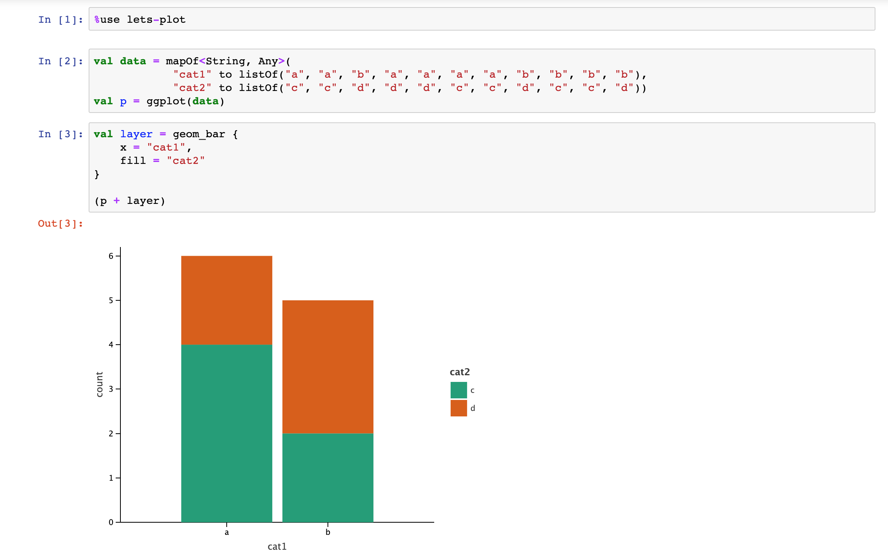

[](https://travis-ci.com/Kotlin/kotlin-jupyter) <br/>

# Kotlin kernel for IPython/Jupyter

Kotlin (1.3.70) REPL kernel for Jupyter (https://jupyter.org).

Alpha version. Tested with Jupyter 6.0.1 on OS X so far.



To start using Kotlin kernel for Jupyter take a look at [introductory guide](https://github.com/cheptsov/kotlin-jupyter-demo/blob/master/index.ipynb).

Example notebooks can be found in the [samples](samples) folder

Try samples online: [](https://mybinder.org/v2/gh/kotlin/kotlin-jupyter/master?filepath=samples)

## Installation

There are two ways to install kernel:

### Conda package

If you have `conda` installed, just run:
 
`conda install kotlin-jupyter-kernel -c jetbrains`

### From sources

Run `./gradlew install`

Use option `-PinstallPath=` to specify installation path. *(Note that Jupyter looks for kernel specs files only in predefined places.)*

Default installation path is `~/.ipython/kernels/kotlin/`.

## Usage

- `jupyter console --kernel=kotlin`
- `jupyter notebook`
- `jupyter lab`

To start using `kotlin` kernel inside Jupyter Notebook or JupyterLab create a new notebook with `kotlin` kernel.

## Supported functionality

### REPL commands

The following REPL commands are supported:
 - `:help` - displays REPL commands help
 - `:classpath` - displays current classpath
 
### Dependencies resolving annotations

It is possible to add dynamic dependencies to the notebook using the following annotations:
 - `@file:DependsOn(<coordinates>)` - adds artifacts to classpath. Supports absolute and relative paths to class directories or jars, ivy and maven artifacts represented by colon separated string
 - `@file:Repository(<absolute-path>)` - adds a directory for relative path resolution or ivy/maven repository
 
### Default repositories

The following maven repositories are included by default:
 - [Bintray JCenter](https://jcenter.bintray.com)
 - [Maven Central](https://repo.maven.apache.org/maven2)
 - [JitPack](https://jitpack.io/)

### Line Magics

The following line magics are supported:
 - `%use <lib1>, <lib2> ...` - injects code for supported libraries: artifact resolution, default imports, initialization code, type renderers
 - `%trackClasspath` - logs any changes of current classpath. Useful for debugging artifact resolution failures
 - `%trackExecution` - logs pieces of code that are going to be executed. Useful for debugging of libraries support
 
### Supported Libraries

When a library is included with `%use` keyword, the following functionality is added to the notebook:
 - repositories to search for library artifacts
 - artifact dependencies
 - default imports
 - library initialization code
 - renderers for special types, e.g. charts and data frames 

List of supported libraries:
 - [klaxon](https://github.com/cbeust/klaxon) - JSON parser for Kotlin
 - [lets-plot](https://github.com/JetBrains/lets-plot-kotlin) - ggplot-like interactive visualization for Kotlin
 - [krangl](https://github.com/holgerbrandl/krangl) - Kotlin DSL for data wrangling
 - [kotlin-statistics](https://github.com/thomasnield/kotlin-statistics) - Idiomatic statistical operators for Kotlin
 - [kravis](https://github.com/holgerbrandl/kravis) - Kotlin grammar for data visualization
 - [spark](https://github.com/apache/spark) - Unified analytics engine for large-scale data processing
 - [gral](https://github.com/eseifert/gral) - Java library for displaying plots
 - [koma](https://koma.kyonifer.com/index.html) - Scientific computing library
 - [kmath](https://github.com/mipt-npm/kmath) - Kotlin mathematical library analogous to NumPy

*The list of all supported libraries can be found in ['libraries' directory](libraries)*

A definition of supported library may have a list of optional arguments that can be overriden when library is included.
The major use case for library arguments is to specify particular version of library. Most library definitions default to `-SNAPSHOT` version that may be overriden in `%use` magic.     

Usage example:
```
%use krangl(0.10), lets-plot
```

### Rich output
  
By default the return values from REPL statements are displayed in the text form. To use richer representations, e.g.
 to display graphics or html, it is possible to send MIME-encoded result to the client using the `MIME` helper function: 
```kotlin
fun MIME(vararg mimeToData: Pair<String, Any>): MimeTypedResult 
```
E.g.:
```kotlin
MIME("text/html" to "<p>Some <em>HTML</em></p>", "text/plain" to "No HTML for text clients")

```
HTML outputs can also be rendered with `HTML` helper function:
```kotlin
fun HTML(text: String): MimeTypedResult
```

### Autocompletion

Press `TAB` to get the list of suggested items for completion. 

*Currently completion suggests only names for user-defined variables and functions.* 

## Debugging

1. Run `./gradlew installDebug`. Use option `-PdebugPort=` to specify port address for debugger. Default port is 1044.
2. Run `jupyter-notebook`
3. Attach remote debugger to JVM with specified port 

## Adding new libraries

To support new `JVM` library and make it available via `%use` magic command you need to create a library descriptor for it.

Check ['libraries'](libraries) directory to see examples of library descriptors.

Library descriptor is a `json` file with the following fields:
- `arguments`: an ordered list of library arguments. All arguments must have default value specified. Argument syntax: `<arg>=<default>`
- `link`: a link to library homepage. This link will be displayed in `:help` command
- `repositories`: a list of maven or ivy repositories to search for dependencies
- `dependencies`: a list of library dependencies
- `imports`: a list of default imports for library
- `init`: a list of code snippets to be executed when library is included
- `initCell`: a list of code snippets to be executed before execution of any cell
- `renderers`: a list of type converters for special rendering of particular types

*All fields are optional

Fields for type renderer:
- `class`: fully-qualified class name for the type to be rendered 
- `result`: expression that produces output value. Source object is referenced as `$it`

Library arguments can be referenced in any parts of library descriptor as `$arg`

There are two places where you can put new library descriptor:
1. For private usage: into local settings folder `<UserHome>/.jupyter_kotlin/libraries`
2. For sharing your library with community: checkout repository, put descriptor into ['libraries'](libraries) directory and create pull request.

If you are maintaining some library and want to update your library descriptor, just create pull request with your update. After your request is accepted, 
new version of your library will be available to all Kotlin Jupyter users on next kernel startup (no kernel update is needed).

Kotlin Kernel collects library descriptors on startup in the following order:
1. Local settings folder (highest priority)
2. ['libraries'](libraries) folder at the latest master branch of `https://github.com/Kotlin/kotlin-jupyter` repository
3. Kernel installation directory

If you don't want some library to be updated automatically, put fixed version of its library descriptor into local settings folder.