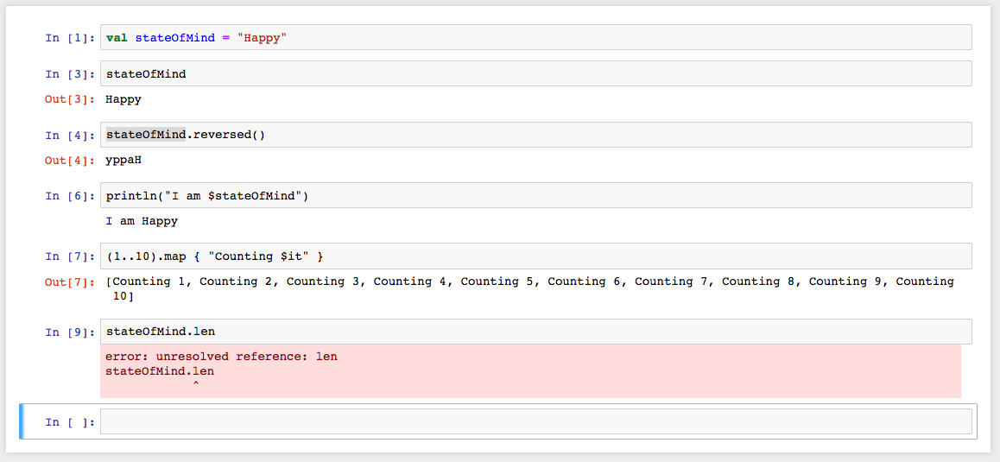

[](https://travis-ci.org/ileasile/kotlin-jupyter) <br/>

# Kotlin kernel for IPython/Jupyter

Basic kotlin (1.3.40) REPL kernel for jupyter (http://jupyter.org).

Autocompletion, history and other advanced features are not yet supported.

Alpha version. Tested with jupyter 5.2.0 on OS X so far.

## Screenshot



## Example 

Example notebook output is [here](samples/KotlinSample01.ipynb). *(It is ported from [Gral](https://github.com/eseifert/gral)
project's `ConvolutionExample.java`).* 

The notebook itself is located in the `samples` folder.

## Supported functionality

### REPL commands

The following REPL commands are supported:
 - `:help` - displays REPL commands help
 - `:classpath` - displays current classpath
 
### Dependencies resolving annotations

It is possible to add dynamic dependencies to the notebook using the following annotations:
 - `@file:DependsOnJar(<relative|absolute-path-in-dir-repo>)` - adds a class directory or jar to the classpath
 - `@file:DirRepository(<absolute-path>)` - adds a directory as a repo
 - `@file:DependsOnMaven(<colon-separated-maven-coordinates>)` - resolves artifacts using maven, downloads them if necessary, and adds to the classpath
 - `@file:MavenRepository(<mavenRepoUrl>)` - adds a maven repository
 
*Note: The maven repositories used are defaulted to Maven Centralas a remote repo and `~/.m2/repository` as a local one.*
  
### MIME output
  
By default the return values from REPL statements are displayed in the text form. To use richer representations, e.g.
 to display graphics or html, it is possible to send MIME-encoded result to the client using the `Result` type 
 and `resultOf` helper function. The latter has a signature: 
```kotlin
fun resultOf(vararg mimeToData: Pair<String, Any>): Result 
```
E.g.:
```kotlin
resultOf("text/html" to "<p>Some <em>HTML</em></p>", "text/plain" to "No HTML for text clients")
```
*(See also `toSvg` function in the [example](samples/KotlinSample01.ipynb)).*

## Installation

Run `./gradlew install`

Use option `-PinstallPath=` to specify installation path. *(Note that jupyter looks for kernel specs files only in predefined places.)*

Default installation path is `~/.ipython/kernels/kotlin/`.

## Usage

`jupyter-console --kernel=kotlin`

or

`jupyter-notebook`

and then create a new notebook with `kotlin` kernel.

## Additional libraries

In addition to using resolving annotations, jars could be added directly to the REPL using `-cp=` parameter in `argv` 
list in the installed `kernel.json` file. Standard classpath format is used. *(Please make sure to use only absolute paths in the `kernel.json` file.)*

## Debugging

- run kernel jar passing some connection config file as a parameter, e.g. `testData/config.json`
    - additional jars for the REPL could be passed using `-cp=` parameter
- run `jupyter-console` passing the full path to the same config file as an argument to the `--existing` command line parameter
